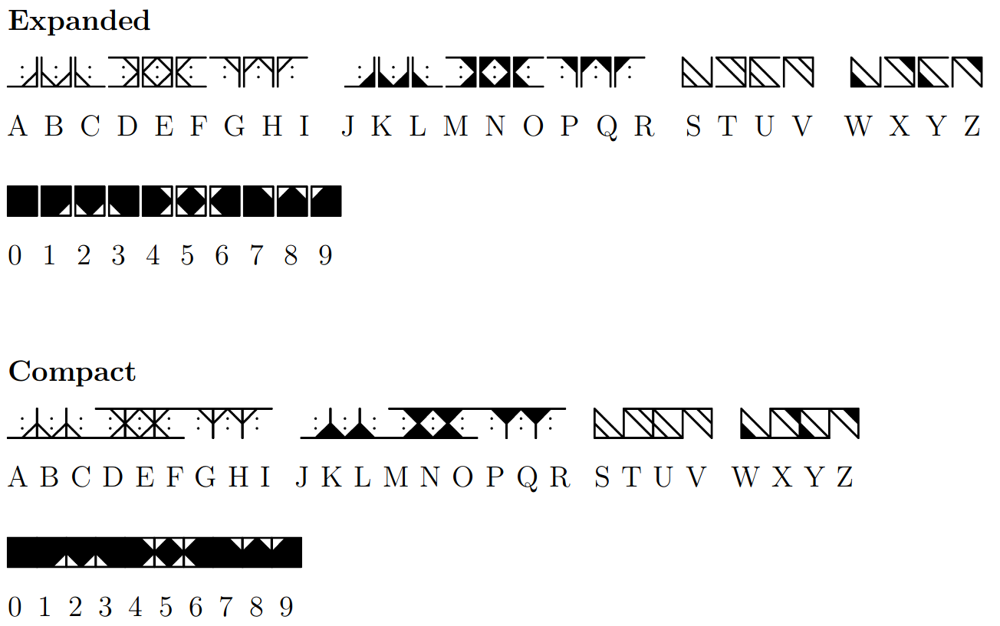
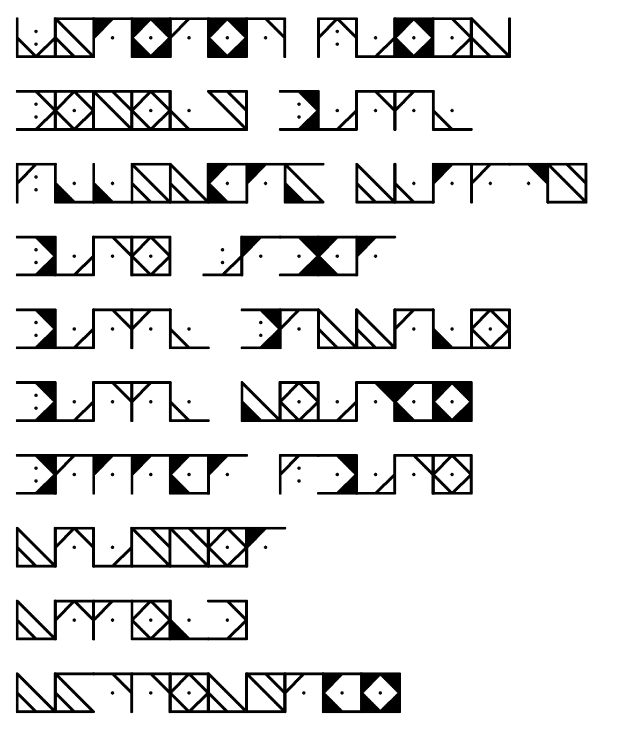

# wizpen

A [Pigpen cipher](https://en.wikipedia.org/wiki/Pigpen_cipher)-inspired font,
originally created for a D\&D wizard spellbook. Unlike Pigpen, characters in
this font can share vertical strokes while still being readable.

>Copying a spell into your spellbook involves reproducing the basic form of
>the spell, then deciphering the unique system of notation used by the wizard
>who wrote it (5E PHB, p. 114)

Based on the LaTeX [pigpen font](https://ctan.org/pkg/pigpen), originally
(C) 2008 Oliver Corff. This is version 1.0.



## Shoutouts

* DMs and brewers at [Battlemage Brewery](http://battlemagebrewing.com/)
  in San Diego, California
* dc858 folks (especially ice)
* Distractions, Inc for peer review and feedback

## Build prereqs

* metafont
* pdflatex
* ruby (if you want to rebuild the font)

## Building

* `make`: Build everything
* `make clean`: Clean everything
* `make redo`: Run `make clean` and `make all`

## Using the font

Create a `texmf` folder like the one here (or just copy it) and
`export TEXMFHOME=mytexmf` before running `pdflatex`.

An example document will look like this:

```tex
\documentclass{article}

\usepackage[top=0.125in,bottom=0.125in,left=0.125in,right=0.125in]{geometry}
\usepackage[letterspace=150]{microtype}
\usepackage{setspace}

\usepackage{wizpen}

\begin{document}

{
    % Uncomment the \lsstyle to add a little spacing between symbols
    \Large \wizpenfont \noindent %\lsstyle
    ABCDEFGHI \enspace JKLMNOPQR \enspace STUV \enspace WXYZ \\ \\
}

\end{document}
```

## Example

Check `spellbook.tex` for spoilers on what all these actually say.



## Modifying the font

`script/wizpen.rb` is how the font gets generated (check the makefile).
If you want to modify it, edit that file, and the font will be regenerated
at the next `make`.

## License

Licensed under the [LaTeX Project Public License](https://ctan.org/license/lppl):
See [LICENSE](LICENSE)

